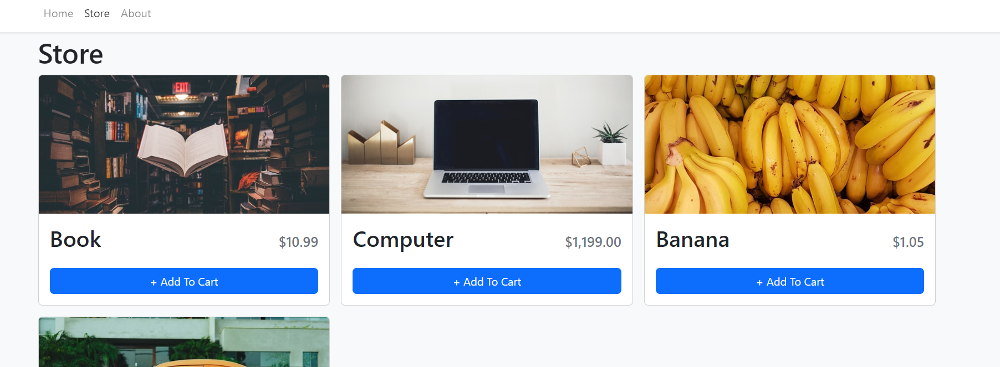
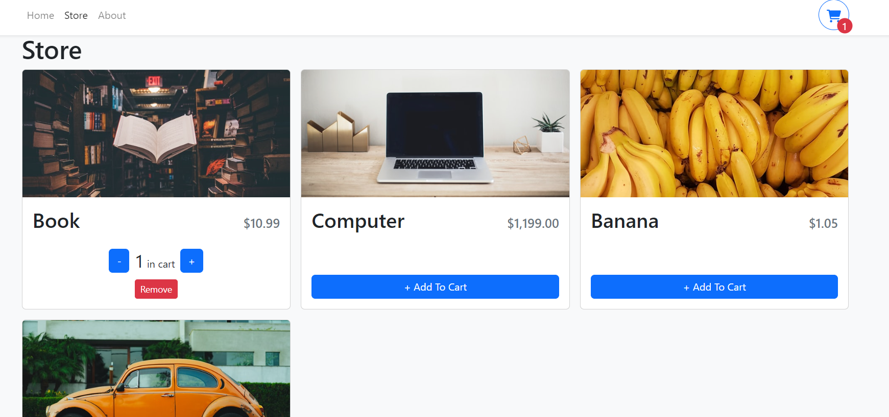

## Shopping Cart

A Shopping Cart frontend app with ReactTs.

The user can add/remove items from the shopping cart.

The items quantity in the shopping cart can be incremented or decremented.

The total is calculated inside the cart.

The quantity is displayed per item and also as a total.

Cart items can be accesed from everywhere inside the application and are also saved inside localstorage.

Only the store page contains items, the other pages are just dummy data pages.

Other technologies/libraries used:

- Bootstrap & React Bootstrap for application design
- Context for frontend data storage
- React Router for page navigation

### App presentation

##### Store page

The store page with a couple of different items with varying prices.

##### Added item

The store page with an item added to the cart where the user can increment/decrement the quantity (if the quantity reaches 0 the item is removed from the cart) or remove the item from the cart.

##### Shopping Cart

In the cart we can see the total of all the items that we have, the quantity of each item displayed in the cart.

Items can be removed directly from the cart.

The cart can be accesed from everywhere and is displayed if it has items into the top right corner of the navbar.

### What I learned?

This project is an advanced shopping cart application made with React Typescript featuring best practices in a real world project with advanced file structuring and naming conventions.

How to use Context API for data storage along with custom hooks including a localstorage hook made to access the items saved from previous sessions into the cart.

How to style using React Bootstrap/Bootstrap.

Practice with React and Typescript.

Vite instead of create-react-app.

### How to run ?

Frontend(client)

> npm run build
